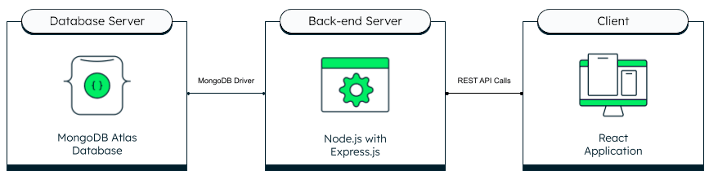

# REST API with Express and MongoDB
This template provides a minimal setup to connect to MongoDB Atlas using ExpressJS with credentials.



## Ukol

__Cílem tohoto úkolu je implementovat CRUD operace v databázi__

### První varianta - Blog (easy mode)

- vytvoř schéma pro články a autory
- implementuj **CRUD** operace pro články i autory

## Project setup

- Project mostly based on this tutorial: [REST API with Express, Node and MongoDB](https://www.mongodb.com/languages/express-mongodb-rest-api-tutorial)


## Mongo DB connection

- First create Configuration file holding Atlas connection string details.
1. Create local *.env*:


```javascript
ATLAS_URI=mongodb+srv://<username>:<password>@sandbox.jadwj.mongodb.net/myFirstDatabase?retryWrites=
PORT=5050
```

2.  Replace the *username* and *password* with the actual credentials 
3. remove comments // and save

### Run the project locally

1. ``npm i``

2. ``npm run dev``

3. ``pnpm run build``

4. ``pnpm link --global``

## Notes

- Start project from scratch: 
- ```pnpm create vite ./ --template react-ts```

## Dependencies

### Expanding the ESLint configuration

If you are developing a production application, we recommend updating the configuration to enable type aware lint rules:

- Configure the top-level `parserOptions` property like this:

```js
export default {
  // other rules...
  parserOptions: {
    ecmaVersion: 'latest',
    sourceType: 'module',
    project: ['./tsconfig.json', './tsconfig.node.json'],
    tsconfigRootDir: __dirname,
  },
}
```

- Replace `plugin:@typescript-eslint/recommended` to `plugin:@typescript-eslint/recommended-type-checked` or `plugin:@typescript-eslint/strict-type-checked`
- Optionally add `plugin:@typescript-eslint/stylistic-type-checked`
- Install [eslint-plugin-react](https://github.com/jsx-eslint/eslint-plugin-react) and add `plugin:react/recommended` & `plugin:react/jsx-runtime` to the `extends` list
